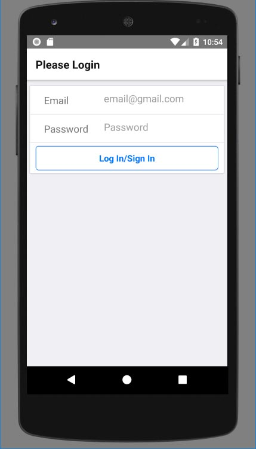
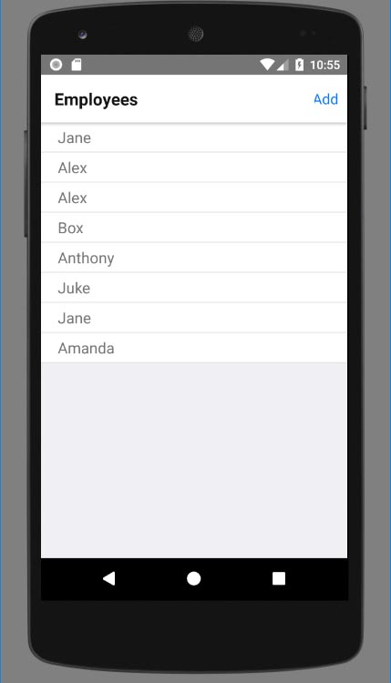
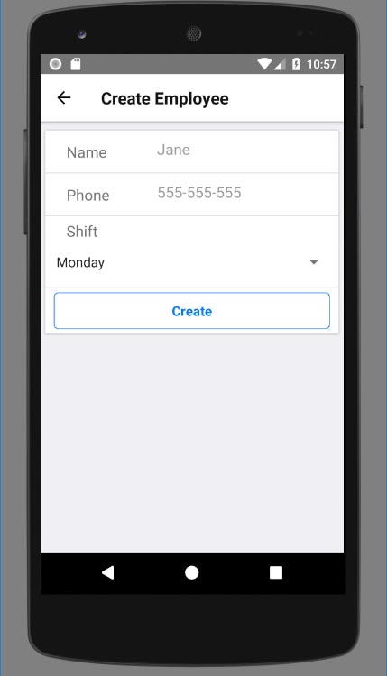
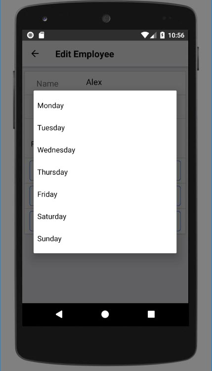
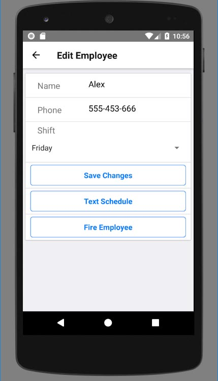
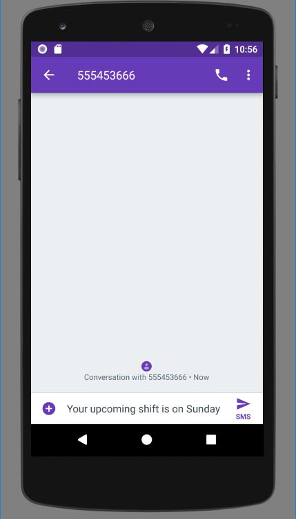
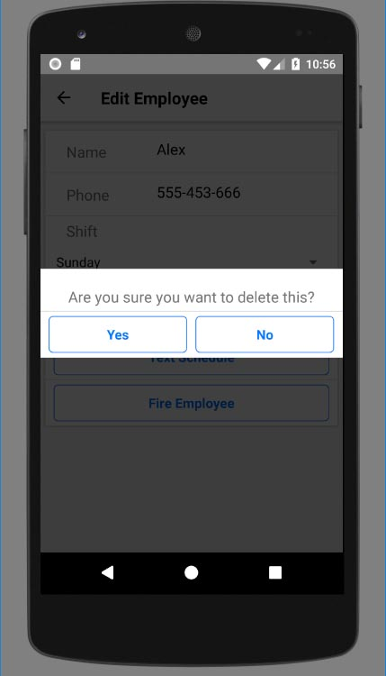

# Manager-app-mobile

Mobile app allowing manager to store and manage information about his employees.

# General description

Application allow users to log in to access their database. If user logs in, adequate database is shown. User can
also sign in - new database is created.
There is one window for user log in/sign in. The code is written in the specific way - if username doesn't exist in
database, new user will be created (I know it's not something we want to see in real life applications, it was used only
in education process).

After creating account/signing in user can do one of the things listed below:
* browse through the list of employees specific for logged in user (employees are shown in form of list, every position
can be tapped to get more information about specific employee),
* add new user,
* edit existing user,
* send a text message (sms) to the specific employee with his schedule (phone default message app will be called).
* delete existing user (popup window will be shown in which user has to confirm his decision).

Every user has specific set of data:
* Name,
* Phone,
* working shift

## Appearanance

Login window and employee list.

Create employee and shift selector.

Edit employee window, send SMS feature opening local message app,

Popup appearing when user wants to delete/fire employee.

# Purpose and technology

This app was created while progressing through the online React Native and Redux course. It's purpose was to practice
all new skills acquired.

## JavaScript React-Native

Application is written entirely in react-native environment. Every part of it is built from functional and class
components. New project is initialized and developed by react-native-cli commands. Android studio was used in order to
emulate the app on PC - which allowed to refresh the application almost instantly after changing the code.

## Redux

In almost all cases components don't use local state. Thank's to Redux, entire application has global state. Components
take information from it, change it by action creators and reducers.

## Google Firebase storage/authentication.

